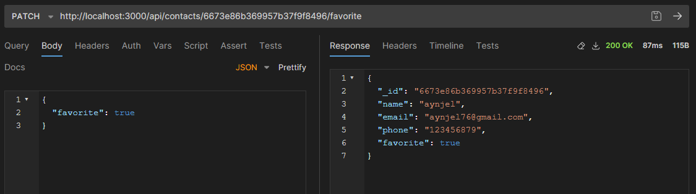

## GoIT Node.js Course Homework

This repository contains my homework for GoIT Node.js course.

### Homework 3 - REST API MongoDB and Mongoose

- PATCH /contacts/:contactId/favorite - update favorite contact
  
