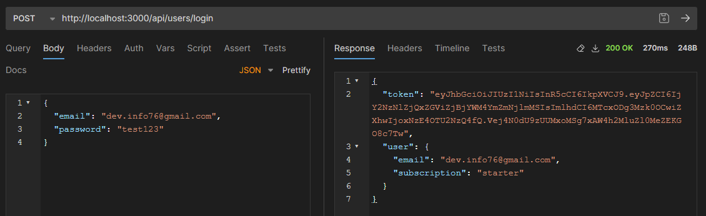
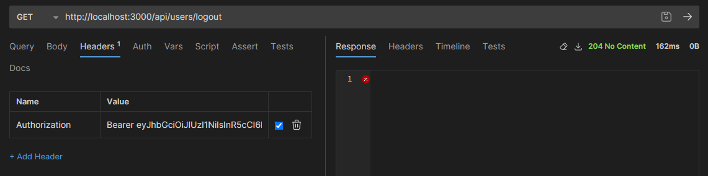
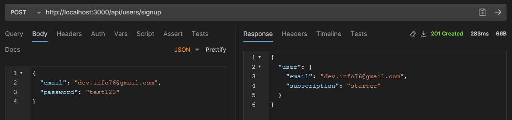
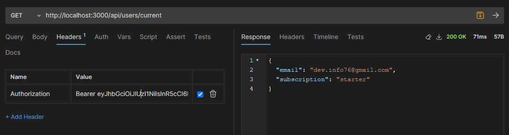

## GoIT Node.js Course Homework

This repository contains my homework for GoIT Node.js course.

### Homework 4 - Authentication and Authorization

- POST /users/login - login user with email and password
  

- GET /users/logout - logout user
  

- POST /users/signup - create new user
  

- GET /users/current - get current user
  
