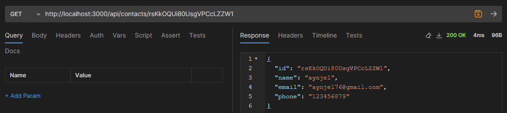

## GoIT Node.js Course Homework

This repository contains my homework for GoIT Node.js course.

### Homework 2 - Express.js

- GET /api/contacts - returns the list of contacts
  
- GET /api/contacts/:contactId - returns the contact by ID
  
- POST /api/contacts - creates a new contact
  
- PUT /api/contacts/:contactId - updates the contact by ID
  
- DELETE /api/contacts/:contactId - deletes the contact by ID
  
