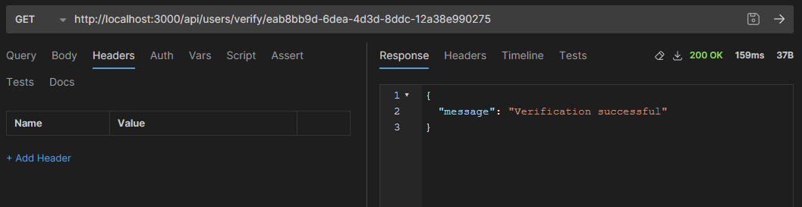
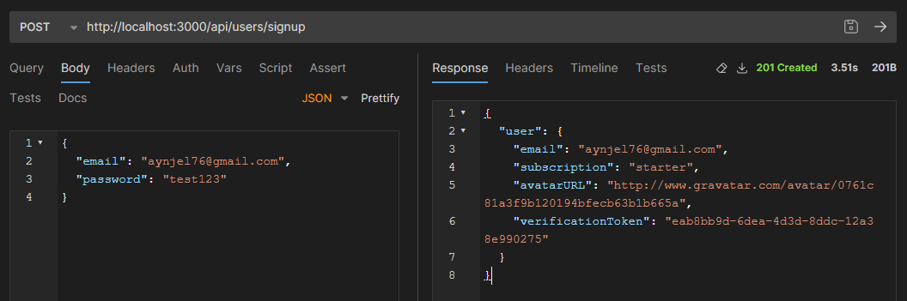
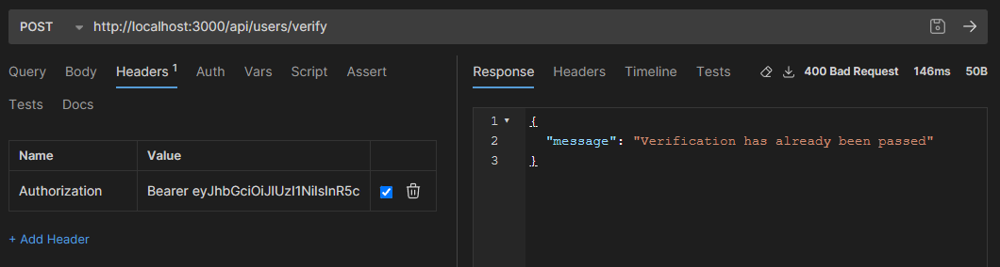

## GoIT Node.js Course Homework

This repository contains my homework for GoIT Node.js course.

### Homework 6 - Email and WebSockets

- GET /users/verify/:verificationToken - verification of email
  

- POST /users/signup - registration of user with token
  

- POST /users/verify - Resend verification email
  
