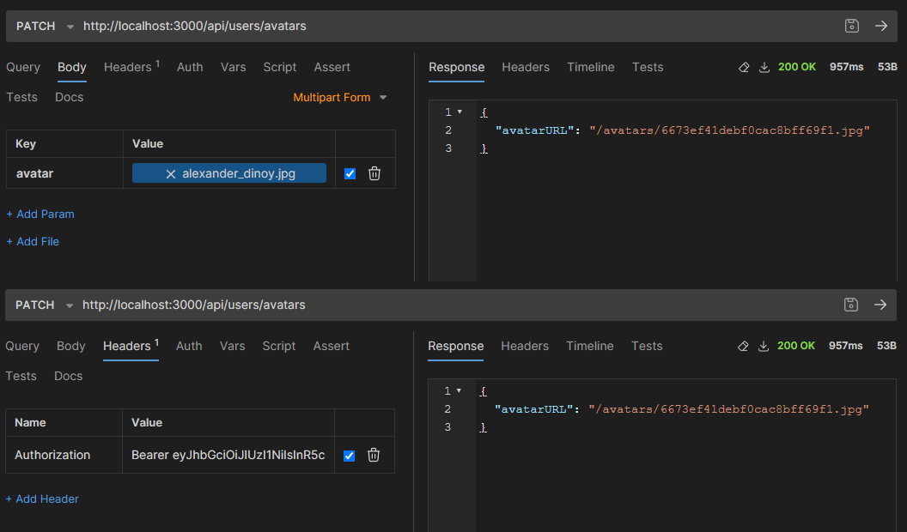
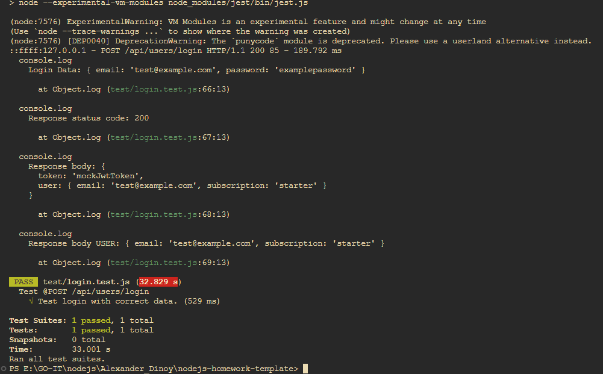

## GoIT Node.js Course Homework

This repository contains my homework for GoIT Node.js course.

### Homework 5 - Work with Images and Testing

- PATCH /users/avatar - upload avatar image
  

- Unit tests for login
  
